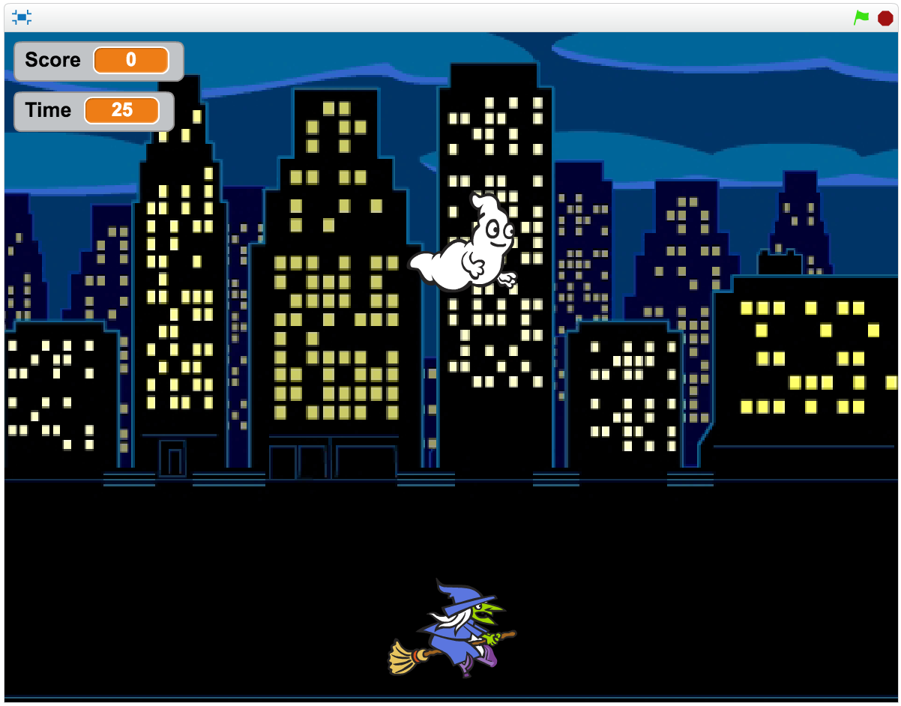
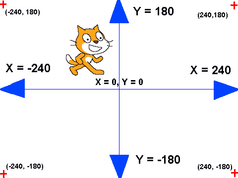

# Creating Games in Scratch
## Lesson 2

---

# Today's Lesson

- Review of last week
- Coordinates
- Create "Ghost Hunt"
- Answer questions
- Extend or change the game and share!

---

# Review of last week

---

# Ghost Hunt

---

# What are Coordinates?

---

# Coordinates

---

# Using Coordinates to Move/Glide (Demo)

---

# Let's Create It!