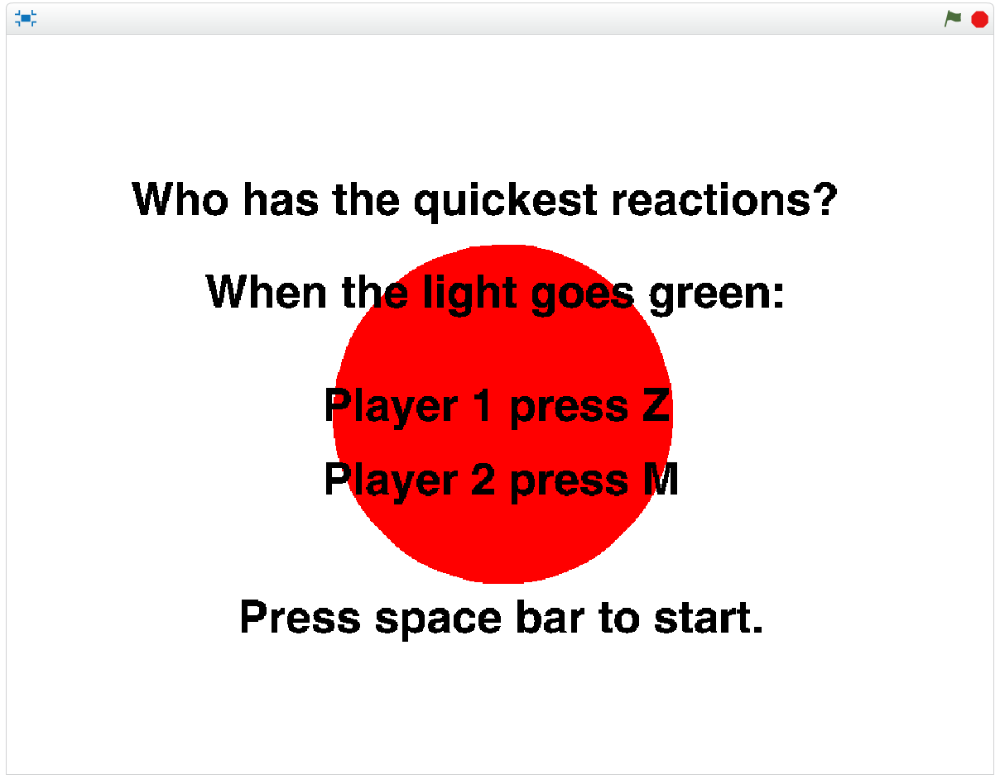

# Creating Games in Scratch
## Lesson 3

---

# Today's Lesson

- Review of last week
- Working in teams
- Create "Rapid Reaction"
- Answer questions
- Extend or change the game and share!

---

# Review of last week

---

# Working Alone

---

# Working Alone

- You get to choose what you do
- You get to work on everything in the project!
- You can work at your own pace

---

# Working in Teams

---

# Working in Teams

- You get opinions and ideas from others
- Developers can work on different parts
- Software often gets developed quicker

---

# How Big are Development Teams?

- Normally start small (1 - 5 software developers)
- Very large (920 software developers work on Windows)
- Average is about 5 - 10 software developers

---

# Rapid Reaction

---

# Let's Create It!

##(in teams of 2)

---

# Rules for Working in Pairs

- Pair up with someone who you don't know well
- Take it in turns to walk through the steps
- Play the game in your pair
- List ideas about how you could extend the game
- Implement those ideas!