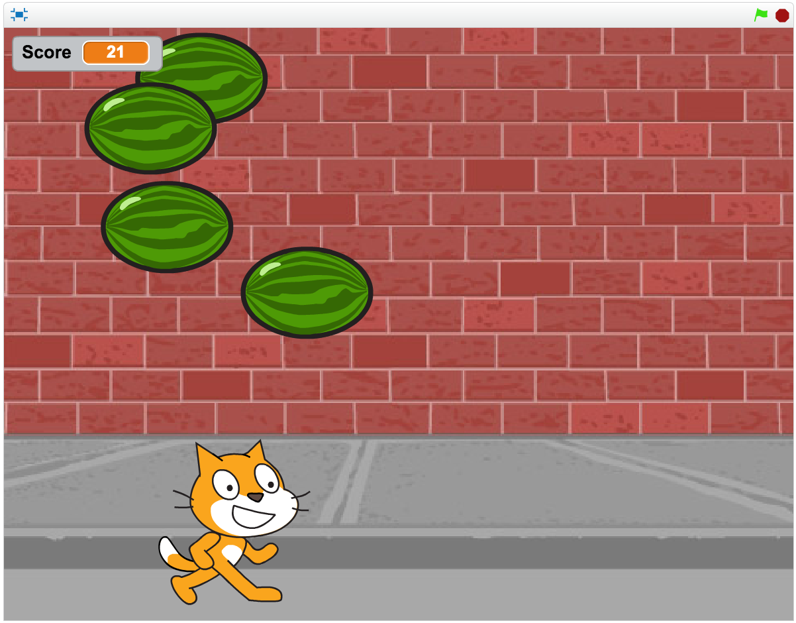

# Creating Games in Scratch
## Lesson 1

---

# Introductions

---

# Next Four Weeks

- Build four games in Scratch!
- Learn what makes a good game
- Extend the games to make them your own
- Have fun!

---

# Fishball

---

# Ghost Hunt

---

# Rapid Reaction

---

# Melon Bounce

---

# Today's Lesson

- What makes a good game?
- Work together to create Fishball
- Answer questions
- Extend or change the game
- Share with the rest of the class

---

# What Types of Games are there?

---

# What Types of Games are there?

- Traditional
- Role Playing
- Racing
- Combat
- Strategy
- Simulator
- Sport
- Puzzle

---

# What Makes a Good Game?

---

# What Makes a Good Game?

- Characters
- Mechanics
- Goals
- Rules
- The World
- Difficulty Level

---

# Planning a game

- Who is the main character?
- What can the character do?
- What is their goal?
- What are the rules?
- What else is in the world?

---

---

- Main Character: Scratch

---

- Do: Run with the ball

---

- Goal: Score as many goals before the time runs out

---

- Rules: Bounce on edges

---

- World?: Fish, the goalkeeper

---

# Let's Create It!